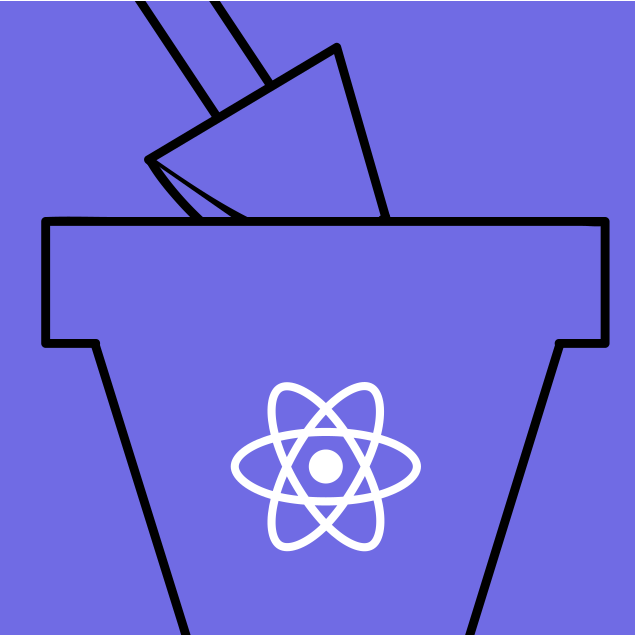
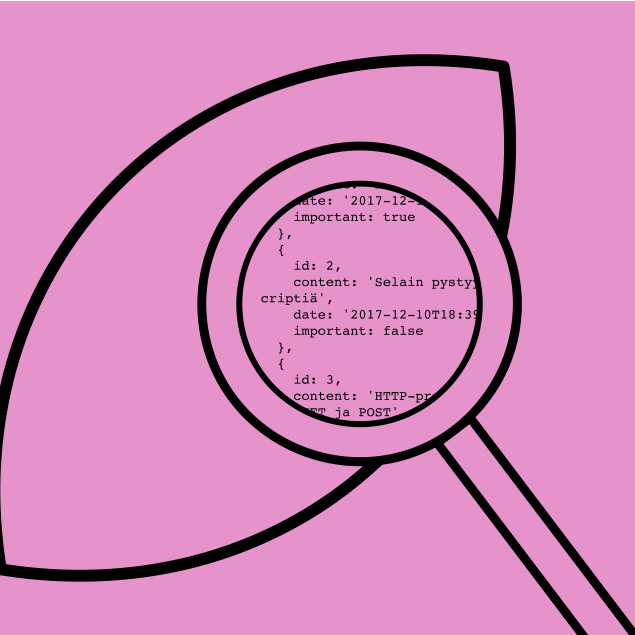

# Full Stack Open

## Course Content

### The **[Full Stack Open](https://fullstackopen.com/en/)** is a free online course on modern web development with a focus on JavaScript-based technologies. It is offered by the University of Helsinki, one of the most renowned universities in Finland.

## [Part 0: Fundamentals of Web apps](https://github.com/felinjob/Full-Stack-Open/tree/main/Part_0)

In this part, we will familiarize ourselves with the practicalities of taking the course. After that, we will have an overview of the basics of web development and also talk about the advances in web application development during the last few decades.

### **Main Topics Covered:**

Introduction to Full-Stack:

* HTTP Protocol: GET and POST requests, headers, and status codes.
* HTML, CSS, and JavaScript: Core technologies for building web pages.
* DOM (Document Object Model): Dynamic manipulation of page content with JavaScript.
* AJAX (Asynchronous JavaScript and XML): Asynchronously loading data without reloading the page.
* Single Page Applications (SPAs): Modern web applications that operate on a single page.
* Developer Tools: Using the Console and the Network tab for inspection and debugging.
* Introduction to Full-Stack Development: Overview of the different layers of a web application and the challenges of the JavaScript ecosystem.

## Part 1: Introduction to React and JavaScript

This part serves as an introduction to the React library and essential JavaScript concepts. We will build a simple React application and learn about the core concepts of React, including components, props, and state. We will also cover essential JavaScript features like variables, arrays, objects, and functions.

### **Main Topics Covered:**

React Introduction:

* Creating a new React project using Vite.
* Understanding the project structure.
* The concept of components.
* How to write React components as JavaScript functions.
* JSX syntax and its relation to HTML.
* Composing larger applications from multiple components.
* Passing data to components using props.
* Debugging React applications using the browser console.

JavaScript Fundamentals:

* Defining variables using `const` and `let`.
* Working with arrays and objects.
* Understanding the concept of functions in JavaScript.
* The role of arrow functions in modern JavaScript.

Component State:

* Adding state to React components using the `useState` hook.
* Modifying state and re-rendering components.
* Understanding the asynchronous nature of state updates.
* Debugging state changes using `console.log`.
* Conditional rendering based on component state.

More Complex State:

* Handling more complex application states.
* Managing arrays within component state.
* Debugging techniques for React applications.
* Using the Chrome developer console effectively.
* Conditional rendering and its importance.

## Part 2: Communicating with server

This part dives deeper into React and introduces the interaction between the frontend and a backend server. We will learn how to fetch and modify data from a server using the `axios` library and explore crucial concepts like asynchronous JavaScript, promises, and RESTful APIs. Additionally, we will cover styling React applications with CSS and managing more complex states.

### **Main Topics Covered:**

Rendering a collection, modules:

* Review of debugging with `console.log` and best practices.
* Iterating over an array of data and rendering components dynamically using `map`.
* Refactoring code into smaller, reusable components.
* Introduction to JavaScript modules and the `import` and `export` statements.

Forms:

* Creating forms in React and handling form submissions.
* The concept of controlled components.
* Handling form input changes and updating component state.
* Displaying dynamic data based on user interactions.
* Filtering and displaying elements based on conditions.

Getting data from server:

* Fetching data from a server using `axios`.
* Understanding asynchronous JavaScript and promises.
* The role of `useEffect` hook in fetching data and side effects.
* Working with external libraries (npm packages).
* Lifecycle methods and component rendering.

Altering data in server:

* Making HTTP requests (GET, POST, PUT, DELETE) using `axios`.
* Understanding RESTful APIs and resource URLs.
* Sending data to a server and handling responses.
* Updating data on the server and re-rendering components.
* Debugging techniques for server communication.
* Error handling in promises.

Adding styles to React app:

* Styling React applications with CSS.
* Using external CSS files and importing them into components.
* Understanding CSS selectors, rules, and declarations.
* Inline styles in React components.
* Best practices for styling React applications.

## Part 3: Node.js and Express

This part focuses on backend development using Node.js and Express. We will learn how to build a RESTful API for our notes application, interact with a MongoDB database, and deploy our application to the internet using Fly.io or Render.

### **Main Topics Covered:**

Node.js and Express:

* Introduction to Node.js and its role in backend development. 
* Setting up a simple Node.js server and understanding HTTP requests and responses.
* Using Express to simplify server-side development and routing. 
* Implementing RESTful API endpoints for creating, reading, updating, and deleting notes.

Deploying app to internet:

* Understanding the same-origin policy and CORS (Cross-Origin Resource Sharing).
* Deploying the application to the internet using Fly.io or Render.
* Creating a production build of the React frontend and serving it from the backend.

Saving data to MongoDB:

* Introduction to MongoDB and document databases.
* Setting up a MongoDB Atlas database and connecting to it from the Node.js backend.
* Using Mongoose to model and interact with data in MongoDB.
* Implementing data validation and error handling.

Validation and ESLint:

* Using Mongoose validation to enforce data integrity.
* Setting up ESLint for code linting and style checking.
* Configuring ESLint rules and integrating it with the development environment.

## Part 4: Testing Express applications, user administration

This part delves into backend testing, user administration, and token-based authentication. We will refactor our backend application, write integration tests using the `node:test` library, and implement user authentication using JSON Web Tokens (JWTs).

### **Main Topics Covered:**

Structure of backend application:

* Refactoring the backend application into separate modules for better organization.
* Extracting logging and environment variable handling into separate modules.
* Using `node:test` for testing and grouping tests with `describe` blocks.
* Writing unit tests for helper functions.

Testing the backend:

* Setting up a test environment and using a separate test database.
* Using SuperTest for making HTTP requests to the backend in tests.
* Writing integration tests for the REST API, including testing the database.
* Understanding and using `async/await` for asynchronous testing.
* Refactoring the backend to use `async/await` and handling errors.

User administration:

* Adding user authentication and authorization to the application.
* Storing users in the database and linking notes to their creators.
* Implementing a route for creating new users and hashing passwords.
* Testing user creation and handling validation errors.

Token authentication:

* Implementing token-based authentication using JWTs.
* Creating a login route and generating JWTs for authenticated users.
* Protecting routes and limiting note creation to logged-in users.
* Handling JWT expiration and invalid tokens.

Legacy: Testing with Jest:

* This section covers testing the backend using Jest (pre-February 13, 2024).
* Installing Jest and configuring npm scripts for testing.
* Writing tests with Jest's `test` and `expect` functions.
* Using Jest matchers like `toBe` and `toEqual` for assertions.
* Grouping tests with `describe` blocks.
* Debugging tests and running tests one by one.

## Part 5: User Authentication, Advanced React, and Testing

This part focuses on implementing user authentication in our React application, exploring advanced React concepts like `props.children`, refs, and PropTypes, and setting up robust testing strategies for both frontend and backend. We will learn how to manage user login, store authentication tokens, and conditionally render components based on user status. Additionally, we will cover unit testing with Vitest and end-to-end testing with Cypress or Playwright.

### **Main Topics Covered:**

Login in frontend:

* Implementing user login functionality in the frontend.
* Handling form submissions and sending login requests to the backend.
* Storing the received authentication token in the application's state.
* Conditionally rendering components based on the user's login status.
* Saving the token to the browser's local storage for persistent logins.
* Fetching and displaying notes only when the user is logged in.

props.children and proptypes:

* Utilizing `props.children` to access and render child components within a pant component.
* Building a reusable `Togglable` component for conditionally displaying content.
* Moving the state of forms to their respective components for better organization.
* Using refs to access and modify the state of child components from the parent.
* Defining PropTypes for components to enforce prop type validation.
* Enhancing the "full stack developer's oath" with additional debugging practices.

Testing React apps:

* Setting up a testing environment for React applications using Vitest and jsdom.
* Writing unit tests for React components using `react-testing-library`.
* Rendering components for testing purposes and making assertions about their output.
* Simulating user interactions like clicking buttons and typing text using `user-event`.
* Using mock functions to test event handlers and component interactions.
* Debugging tests and inspecting component HTML with `screen.debug`.
* Measuring test coverage and identifying untested code.

End to end testing: Playwright:

* Introduction to end-to-end (E2E) testing and its benefits.
* Setting up E2E testing with Playwright and configuring test environments.
* Writing E2E tests for the note application, including user login and note creation.
* Controlling the state of the backend database for reliable testing.
* Refactoring tests with helper functions to avoid code repetition.
* Debugging E2E tests using Playwright Inspector and Trace Viewer.

End to end testing: Cypress:

* Setting up E2E testing with Cypress and configuring test environments.
* Writing E2E tests for the note application, including user login and note creation.
* Controlling the state of the backend database for reliable testing.
* Creating custom Cypress commands for common actions like logging in.
* Debugging Cypress tests using the Cypress Test Runner and developer console.
* Running Cypress tests from the command line and generating test execution videos.

## Part 6: State Management with Redux

This part introduces Redux, a popular library for managing application state in JavaScript applications. We will learn the core concepts of Redux, including actions, reducers, and the store, and how to integrate Redux into our React application for efficient state management. We will also explore Redux Toolkit, a library that simplifies Redux development, and alternative state management solutions like React Query and the Context API.

### **Main Topics Covered:**

Flux architecture and Redux:

* Introduction to Flux architecture and its role in managing application state.
* Understanding the core concepts of Redux: actions, reducers, and the store.
* Creating a simple counter application using Redux to demonstrate state management.
* Writing pure functions and working with immutable data structures in reducers.
* Testing reducers to ensure immutability and correct state updates.
* Using the `createStore` function to create a Redux store.

Many reducers:

* Working with complex state objects in Redux.
* Combining reducers using `combineReducers` to manage different parts of the state.
* Implementing filtering functionality for notes based on their importance.
* Refactoring reducers and action creators using Redux Toolkit's `createSlice` function.
* Using Immer library for simplified immutable updates within reducers.
* Debugging Redux applications with Redux DevTools.

Communicating with server in a Redux application:

* Fetching data from a backend server using `axios` and Redux Thunk.
* Dispatching actions to update the Redux store with fetched data.
* Implementing asynchronous action creators for handling server communication.
* Creating new notes and sending them to the backend server.
* Updating the importance of notes and persisting changes to the server.

React Query, useReducer and the context:

* Introduction to React Query for managing server state in the frontend.
* Fetching and caching data from the server using `useQuery`.
* Updating server data with mutations and invalidating queries.
* Optimizing performance by manually updating query state.
* Using `useReducer` as an alternative to Redux for state management.
* Implementing a counter application with `useReducer` and the Context API.
* Creating custom hooks for accessing and modifying context values.

## Part 7: Class Components, Hooks, Styling and Webpack

This part explores various advanced concepts in React development, including class components, custom hooks, styling techniques, and the Webpack bundler. We will learn how to create and manage class components, extract reusable logic with custom hooks, style our applications with different methods, and bundle our code for production using Webpack.

### **Main Topics Covered:**

Custom hooks:

* The purpose and benefits of custom hooks in React.
* Creating a custom hook for managing a counter.
* Reusing the custom hook in different components.
* Building a custom hook for simplifying form handling.
* Using the `useCountry` hook to fetch country data.
* Extracting backend communication logic into a reusable hook.

More about styles:

* Using ready-made UI libraries like Bootstrap and Material UI for styling.
* Installing and configuring React Bootstrap and Material UI.
* Styling tables, forms, notifications, and navigation menus with UI components.
* Understanding responsive design and simulating different screen sizes.
* Exploring alternative styling approaches like styled-components.

Webpack:

* Introduction to Webpack and its role in bundling JavaScript modules.
* Creating a Webpack configuration file and defining entry and output points.
* Using loaders to process different file types, such as JSX and CSS.
* Transpiling code with Babel to ensure browser compatibility.
* Setting up webpack-dev-server for efficient development workflow.
* Generating source maps for debugging and minifying code for production.
* Configuring development and production environments with Webpack.
* Adding polyfills to support older browsers like Internet Explorer.

Class components, Miscellaneous:

* Understanding class components and their lifecycle methods.
* Creating a simple anecdote application using class components.
* Fetching data from a server using `componentDidMount`.
* Updating state and re-rendering class components with `setState`.
* Comparing class components and functional components with hooks.
* Organizing code in React applications and managing frontend and backend code.
* Exploring advanced topics like WebSockets, virtual DOM, and server-side rendering.
* Discussing security concerns and best practices for React/Node applications.
* Overview of current trends in web development, including microservices and serverless.

Exercises: extending the bloglist:

* Using Prettier for automatic code formatting.
* Implementing state management with Redux or React Query and Context.
* Refactoring the BlogList application to use Redux or React Query.
* Creating views for users, individual users, and blog posts.
* Implementing navigation and comments functionality.
* Improving the appearance of the application with styling techniques.

## Part 8: GraphQL

This part introduces GraphQL, a modern query language for APIs that provides a more efficient and flexible alternative to REST. We will learn how to build a GraphQL server using Apollo Server, define schemas and resolvers, and handle queries and mutations. Additionally, we will cover integrating our GraphQL server with a React frontend using Apollo Client, managing application state with GraphQL, and implementing advanced features like subscriptions and caching.

### **Main Topics Covered:**

GraphQL-server:

* Introduction to GraphQL and its differences from REST.
* Defining a GraphQL schema for a phonebook application.
* Implementing resolvers for queries and mutations.
* Setting up an Apollo Server and handling GraphQL requests.
* Using GraphQL Playground to test queries and mutations.
* Adding features like filtering, sorting, and pagination to queries.
* Implementing error handling and validation for mutations.

React and GraphQL:

* Integrating a React frontend with a GraphQL server using Apollo Client.
* Fetching data from the server using queries and the `useQuery` hook.
* Updating data on the server using mutations and the `useMutation` hook.
* Managing local state in the React application with Apollo Client's cache.
* Implementing user authentication and authorization with GraphQL.
* Building a user interface for the phonebook application with React components.

Database and user administration:

* Connecting the GraphQL server to a MongoDB database using Mongoose.
* Storing and retrieving data from the database with GraphQL resolvers.
* Implementing user authentication and authorization with JWTs.
* Creating and managing user accounts with mutations.
* Securing the API by restricting access to authorized users.

Login and updating the cache:

* Implementing user login functionality in the React frontend.
* Storing and managing authentication tokens with Apollo Client.
* Updating the Apollo Client cache after mutations to keep data in sync.
* Implementing logout functionality and clearing authentication tokens.
* Handling errors and displaying notifications to the user.

Fragments and subscriptions:

* Using fragments to reuse common parts of GraphQL queries.
* Implementing subscriptions for real-time updates from the server.
* Configuring the server and client for WebSocket communication.
* Handling subscription events and updating the UI accordingly.
* Optimizing performance and handling the n+1 problem with GraphQL.

## Part 9: TypeScript

This part introduces TypeScript, a typed superset of JavaScript that adds static typing and other features to improve code quality and maintainability. We will learn the basics of TypeScript, including type annotations, interfaces, and type narrowing, and how to use it in both frontend and backend development. We will also cover setting up a development environment with `ts-node`, configuring `tsconfig.json`, and integrating TypeScript with Express and React.

### **Main Topics Covered:**

Background and introduction:

* What is TypeScript and its benefits for large-scale JavaScript development.
* The relationship between TypeScript and JavaScript.
* Key features of TypeScript, including type annotations, keywords, and structural typing.
* The TypeScript compiler and its role in type erasure and code transformations.
* The TypeScript language service and its use in development tools.

First steps with TypeScript:

* Setting up a TypeScript development environment with `ts-node` and `tsconfig.json`.
* Writing basic TypeScript code and using type annotations.
* Creating custom types with type aliases and interfaces.
* Understanding type narrowing and using type guards.
* Accessing command-line arguments in TypeScript.
* Working with JavaScript modules and external libraries.

Typing an Express app:

* Setting up a TypeScript project with Express and configuring `tsconfig.json`.
* Using the TypeScript compiler (`tsc`) to generate JavaScript code.
* Integrating TypeScript with Express and defining routes with types.
* Creating a production build of the Express application.
* Implementing data validation and type guards for request parameters.
* Using Zod for schema validation and parsing request bodies.

React with types:

* Creating a TypeScript React app with Vite and configuring `tsconfig.json`.
* Defining types for React components and props.
* Using `useState` and `useEffect` with TypeScript.
* Fetching data from a server and handling responses with types.
* Implementing forms and event handlers with types.
* Communicating with a backend server using Axios and types.

Grande finale: Patientor:

* Working with an existing codebase and understanding its structure.
* Using TypeScript types to improve code readability and maintainability.
* Implementing new features and refactoring existing code with types.
* Handling different types of data with discriminated unions and type narrowing.
* Building a user interface with React components and types.
* Fetching and displaying data from a backend server with types.

---
